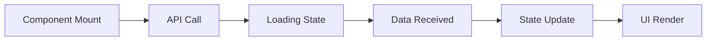

# 🚀 Task Management Dashboard

<div align="center">


A modern, responsive React dashboard application with JWT authentication, dynamic data visualization, and beautiful UI animations.

[Live Demo](#) • [Report Bug](#) • [Request Feature](#)

</div>

---

## � Table of Contents

- [Features](#-features)
- [Tech Stack](#-tech-stack)
- [Getting Started](#-getting-started)
- [Project Structure](#-project-structure)
- [API Integration](#-api-integration)
- [Pages Overview](#-pages-overview)
- [Authentication](#-authentication)
- [Screenshots](#-screenshots)
- [Contributing](#-contributing)
- [License](#-license)

---

## ✨ Features

### � Authentication

- **JWT Token-based Authentication** - Secure login system with token storage
- **Protected Routes** - Dashboard accessible only after successful login
- **Persistent Sessions** - Stay logged in across browser sessions
- **Logout Confirmation** - Prevent accidental logouts with confirmation dialog

### 📊 Dashboard

- **Real-time Statistics** - Live data from REST API
- **User Management** - View and search all users
- **Analytics Tracking** - Monitor views, clicks, and conversions
- **Product Catalog** - Manage products with filtering and search

### 🎨 UI/UX

- **Responsive Design** - Works seamlessly on desktop, tablet, and mobile
- **Modern Animations** - Smooth transitions and Vanta.js 3D backgrounds
- **Interactive Components** - Toast notifications and loading states
- **Clean Interface** - Professional gradient designs and card layouts

### � Dynamic Data

- **100% API-Driven** - All data fetched from REST API
- **Real-time Updates** - Fresh data on every page load
- **Smart Calculations** - Statistics computed from API responses
- **Error Handling** - Graceful error states with retry options

---

## �️ Tech Stack

### Frontend Framework

- **React 19.2.0** - Modern React with hooks
- **Vite 7.3.1** - Lightning-fast build tool
- **React Router 7.13.1** - Client-side routing

### Styling

- **Tailwind CSS 4.2.1** - Utility-first CSS framework
- **Vanta.js** - Animated 3D backgrounds
- **React Icons** - Beautiful icon library

### State Management & API

- **Context API** - Global state management
- **Axios** - HTTP client for API requests
- **React Hot Toast** - Toast notifications

### Development Tools

- **ESLint** - Code linting
- **PostCSS** - CSS processing

---

## 🚀 Getting Started

### Prerequisites

Make sure you have the following installed:

- **Node.js** (v14 or higher)
- **npm** or **yarn**

### Installation

1. **Clone the repository**

   ```bash
   git clone <your-repo-url>
   cd myapp
   ```

2. **Install dependencies**

   ```bash
   npm install
   ```

3. **Start the development server**

   ```bash
   npm run dev
   ```

4. **Open your browser**
   ```
   Navigate to http://localhost:5173
   ```

### Build for Production

```bash
npm run build
```

The optimized build will be in the `dist` directory.

### Preview Production Build

```bash
npm run preview
```

---

## � Project Structure

```
myapp/
├── public/                 # Static assets
├── src/
│   ├── Context/           # React Context for state management
│   │   ├── AuthContext.jsx
│   │   └── AuthProvider.jsx
│   ├── Pages/             # Application pages
│   │   ├── Singin.jsx     # Login page
│   │   ├── Dashboard.jsx  # Main dashboard
│   │   ├── Users.jsx      # Users management
│   │   ├── Analytics.jsx  # Analytics page
│   │   └── Products.jsx   # Products catalog
│   ├── Router/            # Routing configuration
│   │   ├── Router.jsx
│   │   └── PriveteRouter.jsx
│   ├── Root/              # Root layout
│   │   └── Root.jsx
│   ├── index.css          # Global styles & animations
│   └── main.jsx           # Application entry point
├── index.html             # HTML template
├── vite.config.js         # Vite configuration
├── tailwind.config.js     # Tailwind configuration
└── package.json           # Dependencies
```

---

## 🌐 API Integration

### Base URL

```
https://task-api-eight-flax.vercel.app
```

### Available Endpoints

| Endpoint            | Method | Description             |
| ------------------- | ------ | ----------------------- |
| `/api/login`        | POST   | User authentication     |
| `/api/dashboard`    | GET    | Dashboard overview data |
| `/api/users`        | GET    | List all users          |
| `/api/users/:id`    | GET    | Get specific user       |
| `/api/analytics`    | GET    | Analytics data          |
| `/api/products`     | GET    | List all products       |
| `/api/products/:id` | GET    | Get specific product    |
| `/api/overview`     | GET    | Overview statistics     |

### Data Flow



---

## 📄 Pages Overview

### 🏠 Dashboard (`/dashboard`)

- **Overview Statistics**: Total users, active users, revenue, growth rate
- **Recent Users Table**: Latest 5 users with status badges
- **Top Products**: Best-selling products with sales data
- **Dynamic Charts**: Visual representation of key metrics

### 👥 Users (`/users`)

- **User Statistics**: Total, active, and inactive user counts
- **Search Functionality**: Filter users by name or email
- **User Table**: Complete user list with status and join date
- **Status Badges**: Visual indicators for user status

### 📈 Analytics (`/analytics`)

- **Performance Metrics**: Views, clicks, conversions, conversion rate
- **Daily Analytics**: Detailed breakdown by date
- **Trend Indicators**: Growth arrows showing performance changes
- **Calculated Rates**: Dynamic conversion rate calculations

### 🛍️ Products (`/products`)

- **Product Statistics**: Total products, revenue, sales
- **Search & Filter**: Find products by name or category
- **Product Grid**: Card-based layout with product details
- **Revenue Tracking**: Calculated revenue per product

---

## 🔐 Authentication

### Login Credentials

For testing purposes, use these demo credentials:

```
Email: user1@example.com
Password: password123
```

Alternative credentials:

```
Email: john@example.com
Password: password123

Email: jane@example.com
Password: password123
```

### Authentication Flow

1. **User enters credentials** on login page
2. **System validates** email and password
3. **JWT token generated** and stored in localStorage
4. **User data saved** (attempts API, falls back to localStorage)
5. **Redirect to dashboard** with authenticated session
6. **Protected routes** check for valid token
7. **Logout** clears token and redirects to login

### Security Features

- ✅ JWT token-based authentication
- ✅ Protected routes with automatic redirect
- ✅ Persistent login sessions
- ✅ Secure token storage
- ✅ Logout confirmation dialog

---

## 🎨 Design Features

### Color Scheme

- **Primary**: Blue (#3B82F6) to Purple (#9333EA) gradients
- **Success**: Green (#10B981)
- **Warning**: Orange (#F59E0B)
- **Error**: Red (#EF4444)
- **Neutral**: Gray scale for text and backgrounds

### Animations

- **Vanta.js Waves**: 3D animated background on login page
- **Fade-in Effects**: Smooth entry animations for content
- **Hover States**: Interactive feedback on buttons and cards
- **Loading Spinners**: Visual feedback during data fetching
- **Toast Notifications**: Elegant notification system

### Responsive Breakpoints

- **Mobile**: < 768px
- **Tablet**: 768px - 1023px
- **Desktop**: ≥ 1024px

---

## 📸 Screenshots

### Login Page

Beautiful 3D animated background with clean login form

### Dashboard

Comprehensive overview with statistics and recent activity

### Users Management

Searchable user list with status indicators

### Analytics

Detailed performance metrics and trends

### Products Catalog

Grid layout with filtering and search capabilities

---

## 🚀 Deployment

### Deploy to Vercel

1. **Install Vercel CLI**

   ```bash
   npm i -g vercel
   ```

2. **Deploy**
   ```bash
   vercel
   ```

### Deploy to Netlify

1. **Build the project**

   ```bash
   npm run build
   ```

2. **Deploy the `dist` folder** to Netlify

### Environment Variables

No environment variables required for this project.

---

## 🧪 Testing

### Manual Testing Checklist

- [ ] Login with valid credentials
- [ ] Login with invalid credentials (should show error)
- [ ] Navigate to all pages
- [ ] Search functionality on Users page
- [ ] Filter functionality on Products page
- [ ] Logout with confirmation
- [ ] Responsive design on mobile
- [ ] API data loading states
- [ ] Error handling

---

## 🤝 Contributing

Contributions are welcome! Please follow these steps:

1. Fork the repository
2. Create a feature branch (`git checkout -b feature/AmazingFeature`)
3. Commit your changes (`git commit -m 'Add some AmazingFeature'`)
4. Push to the branch (`git push origin feature/AmazingFeature`)
5. Open a Pull Request

---

## 📝 License

This project is created as part of a frontend internship task.

---

## 👨‍💻 Author

**Your Name**

- GitHub: [@yourusername](https://github.com/yourusername)
- LinkedIn: [Your Name](https://linkedin.com/in/yourprofile)
- Email: your.email@example.com

---

## 🙏 Acknowledgments

- **Design Inspiration**: [Task Management Dashboard on Dribbble](https://dribbble.com/shots/25241984-Task-Management-Dashboard)
- **REST API**: Provided by task requirements
- **Vanta.js**: For beautiful 3D backgrounds
- **React Community**: For excellent documentation and support

---

## 📊 Project Stats

- **Total Components**: 8
- **Total Pages**: 5 (Login + 4 Dashboard pages)
- **API Endpoints Used**: 5
- **Lines of Code**: ~3000+
- **Development Time**: Optimized for efficiency

---

<div align="center">

### ⭐ Star this repo if you found it helpful!

Made with ❤️ using React and Tailwind CSS

</div>
